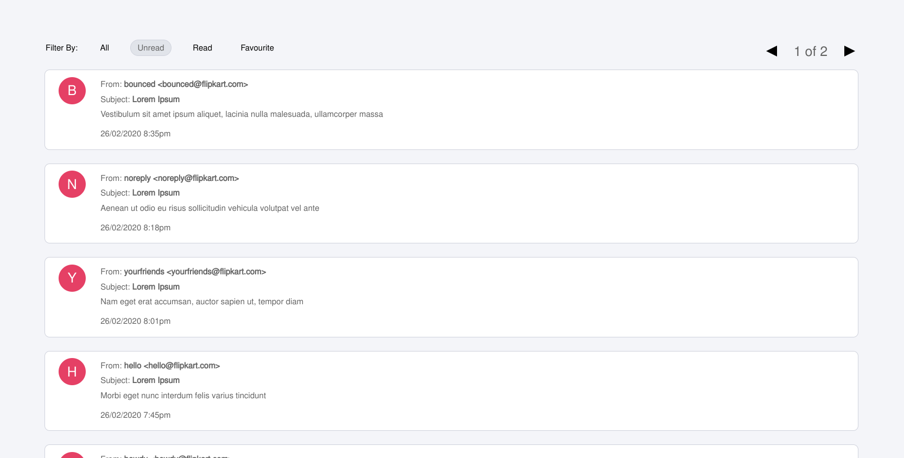

# FabMail App

A React-Redux web application that lets you view your inbox, mark your favourites and allows you to filter them for unread, read, and favourite emails.

## Check it out live here - [https://fab-emailapp.netlify.app](https://fab-emailapp.netlify.app)

### Techs Used

- [React JS](https://reactjs.org/)
- [TypeScript](https://www.typescriptlang.org/)
- [Redux Toolkit with RTQ Query](https://redux-toolkit.js.org/)
- [Tailwind](https://tailwindcss.com/)

### Features

- Inbox view
- Filter for all, read, unread, and favourite emails
- Pagination for all filters
- Split screen to read email
- Mark and unmark your favourite emails
- Persisting data
- Loading and Error handling

### Want to run this on your local machine?

- Clone the repo
- Add all the dependencies using `npm install`.
- Now run the command `npm run dev` to run the application.

### Author

**[Fab](https://github.com/fabcodingzest)** - _A Frontend Web Developer_
